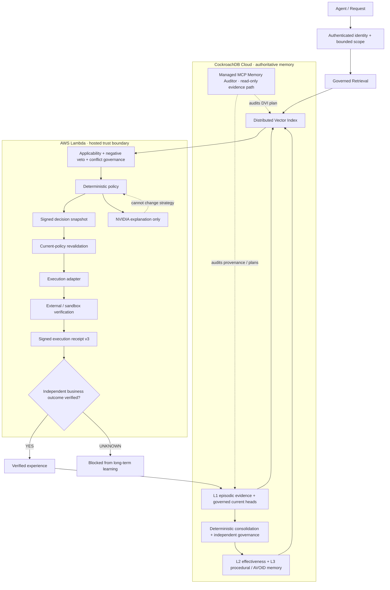

# DecisionVault — submission architecture

Use this as the single architecture frame for the Devpost gallery and the
2:40–2:50 demo video. It is intentionally authority-first rather than a table-by-
table implementation diagram.

## What the judge should understand in 15 seconds

1. CockroachDB is not merely a vector store; it is the authoritative persistent
   memory and governance system of record.
2. Retrieved memory can influence a deterministic decision, but conflict can
   produce a first-class non-executable `ABSTAIN`.
3. Execution is bound to a signed decision snapshot and a verified signed
   receipt.
4. A successful external side effect is not automatically a successful business
   outcome. `UNKNOWN` is blocked from long-term learning.
5. NVIDIA is outside the decision-authority boundary: it provides embeddings and
   bounded explanation, not the final strategy.

## Devpost caption

**DecisionVault authority path.** CockroachDB Cloud stores governed episodic,
semantic, and procedural memory; Distributed Vector Indexing retrieves relevant
evidence; deterministic governance decides whether that evidence may influence
an action; signed snapshots and receipts bind execution; only independently
verified business outcomes can re-enter long-term memory. Managed MCP provides a
separate read-only audit path, while NVIDIA remains explanation-only after the
strategy is committed.
